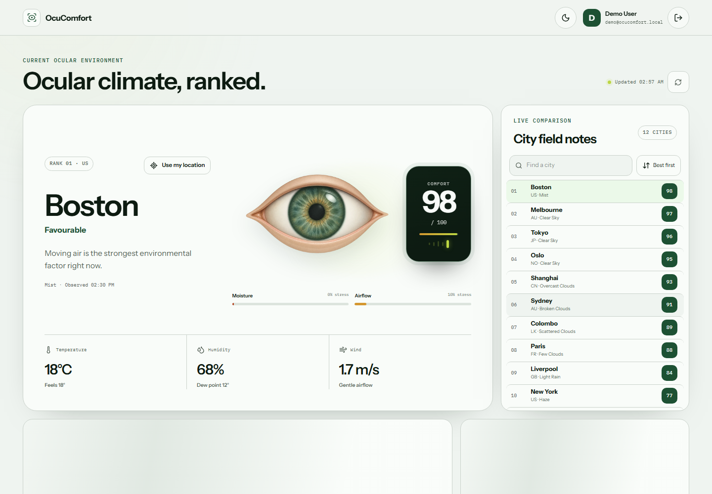
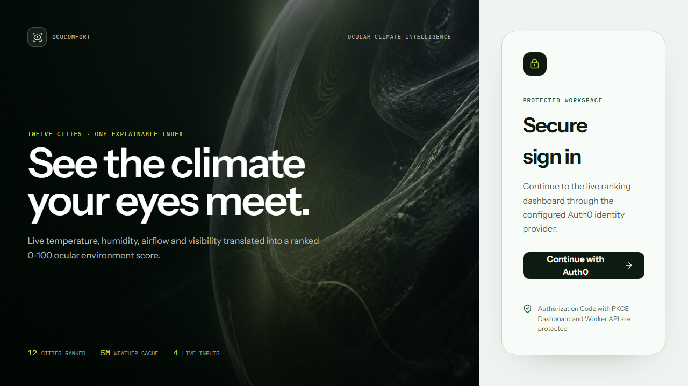
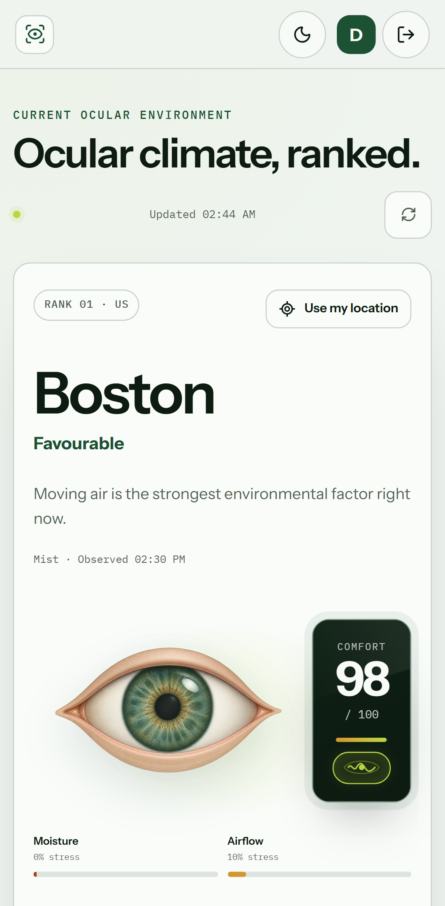
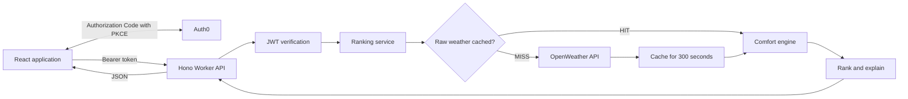

# OcuComfort: Ocular Environmental Comfort Index

OcuComfort is a weather-based ocular comfort index. It helps people notice outdoor conditions that may contribute to dryness, especially low humidity, moving air and reduced atmospheric clarity. The app turns those signals into an explainable score from 0 to 100 and ranks twelve cities from most to least comfortable.

It is intended for environmental awareness and planning. It cannot prevent, diagnose or treat dry-eye damage, and it is not a medical recommendation.

[Open the live application](https://ocucomfort.krishnakumarr.workers.dev)

> OcuComfort describes environmental exposure. It is not a diagnosis, clinical prediction, or medical recommendation.

## Overview

Raw weather values are useful, but they do not immediately explain how dry or windy conditions interact. OcuComfort turns those observations into three layers of information:

- a single comfort score and plain-language classification;
- an explanation of the strongest environmental factor;
- a ranked comparison across the configured cities.

Scores are calculated by the backend. The browser receives normalized weather observations, factor deductions, cache metadata, and the final ranking through a protected API.

## Product preview



| Secure sign-in | Mobile dashboard |
|---|---|
|  |  |

## Features

- Live OpenWeather observations requested by stable city identifiers
- Twelve-city ranking with search and reversible sorting
- Backend-computed, explainable 0-100 comfort score
- Five-minute server-side cache with protected HIT/MISS diagnostics
- Auth0 login, logout, persistent sessions, and independently protected API routes
- Graceful partial results when one or more upstream requests fail
- Optional nearby observation using browser location without changing the fixed ranking
- Interactive comparison and factor charts
- Responsive light and dark themes
- Accessible keyboard controls, reduced-motion support, and overflow-safe layouts

## Comfort model

### Inputs

- **Relative humidity** is the primary moisture signal.
- **Temperature** slightly amplifies moisture stress when the air is already dry and warm.
- **Wind speed** provides a separate airflow stress.
- **Visibility** provides a low-weight atmospheric clarity signal.
- **Dew point** is derived for context but does not receive an additional score weight.

Inputs and intermediate stress values are clamped to safe numeric ranges. Each stress value is normalized from `0` to `1`.
The dashboard shows the raw visibility distance beside `Visibility stress`. A `0%` stress value means OpenWeather reported clear-range visibility, usually `10 km` or more.

```text
HumidityStress = clamp((55 - RelativeHumidity) / (55 - 20))

WarmDrynessModifier = clamp((TemperatureC - 22) / 18)

MoistureStress = clamp(
  HumidityStress × (0.90 + 0.10 × WarmDrynessModifier)
)

AirflowStress = clamp((WindSpeedMps - 1) / (8 - 1))

ClarityStress = clamp(
  (10000 - VisibilityM) / (10000 - 2000)
)

EnvironmentalStress =
    0.70 × MoistureStress
  + 0.20 × AirflowStress
  + 0.10 × ClarityStress

OcularComfort =
  clamp(round(100 × (1 - EnvironmentalStress)), 0, 100)
```

### Why moisture receives more weight

Controlled studies consistently associate lower relative humidity with increased tear evaporation. Controlled airflow can also increase evaporation and dryness symptoms, but the broader evidence is less consistent. Moisture therefore contributes 70% of the composite stress and airflow contributes 20%. Visibility receives 10% as a cautious atmospheric-clarity proxy rather than a direct pollution or health measurement.

The weights and normalization anchors are transparent engineering decisions. They are not published medical thresholds. Temperature remains a small modifier so that warm, dry air is represented without overpowering the humidity signal. Visibility is treated as an experimental signal and is deliberately kept low-weight.

| Score | Interpretation |
|---:|---|
| 85-100 | Favourable |
| 70-84 | Mostly favourable |
| 50-69 | Elevated environmental stress |
| 30-49 | High environmental stress |
| 0-29 | Very high environmental stress |

## Architecture



The React application and API deploy together on one Cloudflare Worker origin. The comfort engine is a pure TypeScript module with no dependency on React, HTTP, Auth0, OpenWeather, or the cache. This separation keeps the formula easy to test and change.

## Engineering decisions

### City data

The source dataset contains eight cities. Four additional stable OpenWeather city IDs (Melbourne, New York, Delhi, and Dubai) bring the comparison to twelve. Every record is labelled as `provided` or `supplemental`, so added data is explicit and the original records remain unchanged.

### Caching

Raw OpenWeather responses are cached for exactly 300 seconds using keys such as `weather:1248991`. Production uses the Cloudflare Workers Cache API; local and automated tests use an in-memory adapter with the same interface.

Processed results are recalculated after a raw-cache read because the comfort calculation is pure and inexpensive. This avoids a second invalidation path. The cache is regional to a Cloudflare data centre, so the first request from another region can still be a MISS.

### Failure handling and performance

Upstream work is limited to five simultaneous requests. Failed cities are returned as metadata while successful cities remain available and correctly ranked. Concurrent cold requests for the same city share one in-flight provider promise, preventing request bursts from multiplying OpenWeather calls.

Live data mode fails closed when the OpenWeather key is missing; it never substitutes fixture observations. Deterministic fixtures are available only when demo mode is selected explicitly.

### Sign-in and security

The frontend uses Auth0 Authorization Code with PKCE. Protected Worker routes independently verify the access-token signature, issuer, audience, and expiry through Auth0 JWKS.

The Auth0 tenant must provide the allowed callback, logout, and web origins. Public signup should be disabled, approved users should be created manually, and MFA policy is managed in Auth0 rather than application code.

Sessions are stored through the Auth0 SDK's local-storage option so a normal refresh does not return an authenticated user to the sign-in screen. This improves continuity but carries the standard local-storage XSS trade-off. The app does not inject third-party runtime scripts into the page.

## Technology

| Area | Technology |
|---|---|
| Frontend | React 19, TypeScript, Vite, TanStack Query, Recharts |
| API | Hono on Cloudflare Workers |
| Authentication | Auth0, OpenID Connect, JWT, PKCE |
| Weather | OpenWeather Current Weather API |
| Testing | Vitest, Testing Library, Playwright, axe-core |
| UI | Instrument Sans, IBM Plex Mono, Lucide icons |

## Local development

### Requirements

- Node.js 22 or later
- An OpenWeather API key for live observations
- Auth0 SPA and API settings for authenticated mode

Install dependencies:

```bash
npm ci
```

Copy `.env.example` to `.env`, then configure either deterministic demo mode or live mode.

### Demo mode

```env
VITE_AUTH_MODE=demo
AUTH_MODE=demo
DATA_MODE=demo
```

### Live mode

```env
VITE_AUTH_MODE=auth0
VITE_AUTH0_DOMAIN=your-tenant.auth0.com
VITE_AUTH0_CLIENT_ID=your-client-id
VITE_AUTH0_AUDIENCE=https://your-api-audience

AUTH_MODE=auth0
DATA_MODE=live
OPENWEATHER_API_KEY=your-key
AUTH0_DOMAIN=your-tenant.auth0.com
AUTH0_AUDIENCE=https://your-api-audience
```

Keep Worker secrets in `.dev.vars` for local Worker development and in Cloudflare secrets for production. The OpenWeather key is never sent to the browser.

Start the development server:

```bash
npm run dev
```

## API

| Method | Route | Access | Description |
|---|---|---|---|
| `GET` | `/api/health` | Public | Service health and algorithm identifier |
| `GET` | `/api/rankings` | Protected | Ranked city observations |
| `GET` | `/api/cities/:id` | Protected | One configured city observation |
| `GET` | `/api/location?lat=&lon=` | Protected | Unranked nearby observation |
| `GET` | `/api/debug/cache` | Protected | Cache status, age, and TTL |

## Testing

Run the complete quality gate:

```bash
npm run verify
npm run test:stress
npm audit --audit-level=high
```

`npm run verify` runs linting, TypeScript checks, coverage-enforced tests, a production build, and the desktop/mobile Playwright suite. The tests cover score behaviour, city parsing and sorting, caching, authorization, provider failures, request coalescing, nearby observations, accessibility, responsive layout, session persistence, charts, loading states, and error recovery.

Coverage thresholds apply to the domain and Worker layers:

- 85% lines, statements, and functions
- 75% branches

The stress command reports local regression measurements for cold-request coalescing, cached service throughput, and the complete Worker HTTP route. These figures are development diagnostics rather than production capacity claims.

## Deployment

Store the Worker secrets, build, and deploy:

```bash
npx wrangler secret put OPENWEATHER_API_KEY
npx wrangler secret put AUTH0_DOMAIN
npx wrangler secret put AUTH0_AUDIENCE
npm run build
npx wrangler deploy
```

Production mode is fixed to `DATA_MODE=live` and `AUTH_MODE=auth0` in `wrangler.jsonc`.

## Limitations

- The score is evidence-informed but has not been clinically validated.
- Outdoor station readings cannot represent indoor conditions or personal exposure.
- Moisture, airflow and visibility are simplified into smooth engineering normalizations.
- Visibility is only an atmospheric-clarity proxy; it does not measure particulate pollution.
- Cloudflare cache entries are regional rather than globally replicated.
- Processed results are not cached separately because calculation is inexpensive.
- Auth0 signup and MFA policies require manual tenant configuration.
- UV and particulate pollution are outside the current data model.

## Research

- [TFOS DEWS III: Management and Therapy](https://pubmed.ncbi.nlm.nih.gov/40467022/)
- [Relative humidity and aqueous tear evaporation](https://pubmed.ncbi.nlm.nih.gov/16564822/)
- [Impact of evaporation on aqueous tear loss](https://pubmed.ncbi.nlm.nih.gov/17471332/)
- [Effect of low humidity on the human tear film](https://pubmed.ncbi.nlm.nih.gov/23023409/)
- [DREAM climatic and environmental correlates study](https://pubmed.ncbi.nlm.nih.gov/32821497/)
- [Controlled wind exposure study](https://pubmed.ncbi.nlm.nih.gov/29095724/)
- [TFOS Lifestyle Report: environmental conditions](https://pubmed.ncbi.nlm.nih.gov/37062427/)
